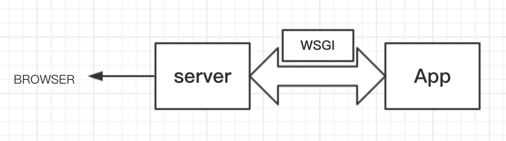
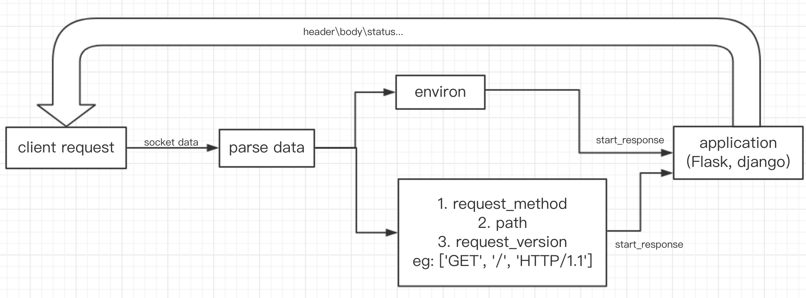

WSGI，是Python Web Server Gateway Interface的简称，是web底层跟application解耦的协议，我们的web服务器使用WSGI协议来调用application称为WSGI server。为了各类web server和web application之间能够相互兼容，常见的web server（如Nginx，Apache）无法与web application（如Flask，django、tornado）直接通信，需要WSGI server作为桥梁。如今WSGI已经成为Python的一种标准协议[PEP333](https://www.python.org/dev/peps/pep-0333/)。



### WSGI的工作原理

WSGI的工作原理分为服务器层和应用程序层：

1. 服务器层：将来自socket的数据包解析为http，调用application，给application提供环境信息environ，这个environ包含wsgi自身的信息（host，post，进程模式等），还有client的header和body信息。同时还给application提供一个start_response的回调函数，这个回调函数主要在应用程序层进行响应信息处理。
2. 应用程序层：在WSGI提供的start_response，生成header，body和status后将这些信息socket send返回给客户端。

上面的工作原理通过流程图可以表示如下：



可以看到，wsgi server已经完成了底层http的解析和数据转发等一系列网络底层的实现，开发者可以更加专注于开发web application。

### 使用wsgiref模块理解WSGI工作流程

Python自带模块`wsgiref`可以实现上述WSGI工作流程，这里使用wsgiref实现一个wsgi server的例子，以对wsgi的流程有感性的认识。

```python
from wsgiref.simple_server import make_server
def application(environ, start_response):
    start_response('200 OK', [('Content-Type', 'text/html')])
    return [b'<h1>Hello, web!</h1>']
if __name__ == '__main__':
    httpd = make_server('', 9999, application)
    print("Serving HTTP on port 9999...")
    httpd.serve_forever()
```

该例子中application就是web application，这里是定义为一个函数，在实际的Flask和bottle中，就是一个类，这些类实现`__call__`方法，且该方法中带参数`environ`和`start_response`即可，运行server时只需调用`self`即可，例如：

```python
class Flask:
  def __init__(self):
    # init params
    pass
  
  def __call__(self, environ, start_response):
    start_response('200 OK', [('Content-Type', 'text/html')])
    return [b'<h1>Hello, web!</h1>']
  
  def listen(self, port)
  	from wsgiref.simple_server import make_server
		server = make_server('127.0.0.1', 9999, self)
		print('serve on 127.0.0.1:9999')
		server.serve_forever()
```

因此，在这里例子里，可以具体看到wsgi server调用application后，在start_response中application返回`header`、`content-type`和`body`，最后在浏览器打开127.0.0.1:9999即可看到由wigs server返回的内容。

### 自己实现一个wsgi server

了解了wsgi的工作原理和具体的使用例子，我们自己来实现一个wsgi服务器，可以进行请求解析，并可以调用Flask暴露出来的wsgi_app参数来将Flask运行起来。

首先组织代码结构：

```python
import socket
import StringIO
import sys

class WSGIserver(object):
  def __init__(self):
    pass
  
  def serve_forever(self):
    pass
  
  def handle_one_request(self):
    request_data = '' # 暂不处理
    self.parse_request(request_data)
    env = self.get_environ()
    result = self.application(env, self.start_response)
    self.finish_response(result)
    
  def parse_request(self, data):
  	pass
  
  def get_environ(self):
    pass
  
  def start_response(self, status, response_headers, exc_info=None):
    pass
  
  def finish_response(self, result):
    pass
  
def make_server(server_address, application):
	server = WSGIServer(server_address)
	server.set_app(application)
	return server
  
if __name__ == '__main__':
  httpd = make_server('', 8888, application)
  httpd.serve_forever()
```

分析如下：

1. `__init__`:wsgi server的初始化操作
2. `serve_forever`:可以让wsgi server一直监听客户端请求
3. `handle_one_request`:对每一次请求进行参数解析，包括`parse_request`和`get_environ`
4. `start_response`:传递给application的回调函数，根据[PEP333](https://www.python.org/dev/peps/pep-0333/)，`start_response`需要包含`status`, `response_headers`, `exc_info`三个参数。`status`是http的状态码，如“200 OK”,"404 Not Found"。`response_headers`是一个`(header_name, header_value)` 元组的列表，在进行application开发时需要注意这点。`exc_info`通常不需要，直接设置为None即可。具体的一些参数的解释可以参考协议的详细解释。
5. `finish_response`:解析一次请求后，需要关闭socket端口，同时将application返回的data返回至客户端。

有了代码结构，根据PEP333标准协议，那么具体可以完善上述代码，如下(wsgi.py)：

```python
#!/usr/bin/env python
# -*- coding: utf-8 -*-

import socket
import StringIO
import sys

class WSGIServer(object):

	address_family = socket.AF_INET
	socket_type = socket.SOCK_STREAM
	request_queue_size = 1

	def __init__(self, server_address):

		# 创建socket，利用socket获取客户端的请求
		self.listen_socket = listen_socket = socket.socket(self.address_family, self.socket_type)
        # 设置socket的工作模式
		listen_socket.setsockopt(socket.SOL_SOCKET, socket.SO_REUSEADDR, 1)
		# 绑定socket地址
		listen_socket.bind(server_address)
		# socket active， 监听文件描述符
		listen_socket.listen(self.request_queue_size)

		# 获得serve的host name和port
		host, port = self.listen_socket.getsockname()[:2]
		self.server_name = socket.getfqdn(host)
		self.server_port = port

		self.headers_set = []

	def set_app(self, application):
		self.application = application 

    #启动WSGI server服务，不停的监听并获取socket数据。
	def serve_forever(self):
		listen_socket = self.listen_socket
		while True:
			self.client_connection, client_address = listen_socket.accept() #接受客户端请求
            #处理请求
			self.handle_one_request()

	def handle_one_request(self):
		self.request_data = request_data = self.client_connection.recv(1024)
		self.parse_request(request_data)
		# print(''.join(
  #           '< {line}\n'.format(line=line)
  #           for line in request_data.splitlines()
  #       ))
  		# Construct environment dictionary using request data
		env = self.get_environ()
      
        #给flask\tornado传递两个参数，environ，start_response
		result = self.application(env, self.start_response)
		self.finish_response(result)

    #处理socket的http协议
	def parse_request(self, data):
		format_data = data.splitlines()
		if len(format_data):
			request_line = data.splitlines()[0]
			request_line = request_line.rstrip('\r\n')
			(self.request_method, self.path, self.request_version) = request_line.split() ## ['GET', '/', 'HTTP/1.1']

    # 获取environ数据并设置当前server的工作模式
	def get_environ(self):
		env = {}
		env['wsgi.version']      = (1, 0)
		env['wsgi.url_scheme']   = 'http'
		env['wsgi.input']        = StringIO.StringIO(self.request_data)
		env['wsgi.errors']       = sys.stderr
		env['wsgi.multithread']  = False
		env['wsgi.multiprocess'] = False
		env['wsgi.run_once']     = False
		# Required CGI variables
		env['REQUEST_METHOD']    = self.request_method    # GET
		env['PATH_INFO']         = self.path              # /hello
		env['SERVER_NAME']       = self.server_name       # localhost
		env['SERVER_PORT']       = str(self.server_port)  # 8888
		return env

	def start_response(self, status, response_headers, exc_info=None):
		server_headers = [('Date', 'Tue, 31 Mar 2015 12:54:48 GMT'), ('Server', 'WSGIServer 0.2')]
		self.headers_set = [status, response_headers + server_headers]

    #把application返回给WSGI的数据返回给客户端。
	def finish_response(self, result):
		try:
			status, response_headers = self.headers_set
			response = 'HTTP/1.1 {status}\r\n'.format(status=status)
			for header in response_headers:
				response += '{0}: {1}\r\n'.format(*header)
			response += '\r\n'
			for data in result:
				response += data
			self.client_connection.sendall(response)
			print(''.join(
                '> {line}\n'.format(line=line)
                for line in response.splitlines()
            ))
		finally:
			self.client_connection.close()

SERVER_ADDRESS = (HOST, PORT) = '', 8888

def make_server(server_address, application):
	server = WSGIServer(server_address)
	server.set_app(application)
	return server


if __name__ == '__main__':
	if len(sys.argv) < 2:
		sys.exit('Provide a WSGI application object as module:callable')
	app_path = sys.argv[1]
	module, application = app_path.split(':') # 第一个参数是文件名，第二个参数时长文件内app的命名
	module = __import__(module)
	application = getattr(module, application) # getattr(object, name[, default]) -> value
	httpd = make_server(SERVER_ADDRESS, application)
	print('WSGIServer: Serving HTTP on port {port} ...\n'.format(port=PORT))
	httpd.serve_forever()


```

至此，wsgi server的代码已完成，下面写一个简单的Flask实例(flaskapp.py)来验证这个server是否可用:

```python
from flask import Flask
from flask import Response

flask_app = Flask(__name__)

@flask_app.route('/hello')
def hello_world():
	return Response(
		'hello',
		mimetype='text/plain'
	)

app = flask_app.wsgi_app # 调用Flask暴露的wsgi_app,提供给wsgi server作为application，而不是直接run(port)
```

在终端输入：

```
$python wsgi.py flaskapp:app
WSGIServer: Serving HTTP on port 8888 ...
```

打开浏览器，输入`http://localhost:8888/hello`可看到hello的信息，同时，终端输出一些request和response的信息：

```shell
> HTTP/1.1 200 OK
> Content-Type: text/plain; charset=utf-8
> Content-Length: 5
> Date: Tue, 31 Mar 2015 12:54:48 GMT
> Server: WSGIServer 0.2
>
> hello
```

### 总结

本文主要从WSGI的原理入手，同时通过原生wsgiref模块了解了WSGI的工作流程，最后利用socket模块自己实现了一个WSGI server，我们可以通过Flask这类web框架暴露出来的WSGI接口启动应用。

由于WSGI实现了web server和web application的高度解耦，在具体的使用中可以使用一些比较成熟的WSGI server如uwsgi和gunicorn对任何一个符合WSGI规范的app进行部署，这给Python Web应用的部署带来了极大的灵活性。

（完）

参考：

[打造mvc框架之wsgi协议的优缺点及接口实现](http://xiaorui.cc/?p=3209 )

[PEP 333 -- Python Web Server Gateway Interface v1.0](https://www.python.org/dev/peps/pep-0333/#environ-variables)