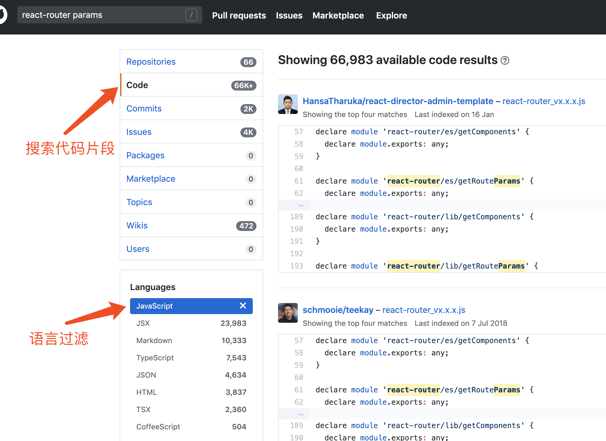

​        身为开发者，在工作中难免会遇到各类各样的问题，比如某天本来运行良好的xcode突然报错`xxx.h is not found`、Android编译失败等问题都是很常见，但是不好解决，也是日常工作上最不想遇到的，那么遇到这类问题的时候该怎么解决呢，本文将介绍下自己平时使用的解决方法。


<h3>求助同事、朋友</h3>
​        遇到了问题，直接求助同事、朋友是最快的解决办法，也是很多刚开始工作或独立思考能力不足的朋友经常使用的办法，但我认为也是效率最低下也最不推荐的方法。一方面，你不确定你问的人是不是真的有遇到过你的问题，是否真的有解决这个问题的经验，如果你咨询了对方，对方不好意思拒绝，也得跟你一起找解决方法，最后解决一个问题的时间浪费了两个人乃至多个人的时间。另一方面，如果对方直接给你提供了解决方法，一部分人对此问题也就到此为止，问题解决了，但你可能最后不知道这个问题为什么要怎么解决、下次再遇到此类问题又该怎么解决，这时候你又会继续求助同事，长此以往就形成了一种恶性循环，自己也停留在帮别人拧螺丝的体力活上。


解决问题速度: 4/5

自我提升程度: 1/5

推荐程度: 1/5


<h3>使用国内搜索引擎</h3>
​        国内搜索引擎，如baidu、bing国内版一流，因为可以直接访问、搜索速度快、搜索结果以中文居多，以致成为国内大部分程序员解决问题时用的最多的搜索引擎，但这一类搜索引擎对某些站点的SEO很高，而这些站点上的内容往往就是没有经过任何验证的互相抄袭，最明显的就是通过baidu搜索出来的技术问题，第一页80%都是CSDN站的文章，不可否认，CSDN上确实有高质量的文章，但绝大多数依旧是一些互相抄袭、观点模糊、全文粘贴没有任何注释的代码的文章，遇到这类文章就需要自己费点心思去甄别和筛选了，如果你被CSDN这类的高权重SEO站点困扰，不想在搜索引擎上出现此类站点，那么在搜索时使用`-[website]`来进行过滤，如你正在搜索react-router的参数传递用法，搜索引擎上关键字如下:

```
react-router如何传递参数 -csdn
```


个人认为，国内搜索引擎通过中文结果里，常见站点内容实用度排名如下:

```
segmentfault > 博客园 > 简书 > CSDN
```

其实还有一个比较靠谱的结果，那就是一些个人博客，这些个人博客是开发者使用自己服务器搭建的，上面往往是当前开发者最擅长领域的经验总结，绝大多数的个人博客文章质量都很高，但这类站点往往不会出现在baidu一类国内搜索引擎的的前两页，至于原因你懂的。

 

解决问题速度: 3/5

自我提升程度: 3/5

推荐程度: 2/5


<h3>使用Google</h3>
​        如果你可以使用Google，那么你就拥有了全世界最强的搜索引擎和最全面的技术疑难问题集，如果搜索关键字正确，那么在国内搜索引擎里找不到答案的内容在Google也能快速找到答案，这也是我平时用的最多的解决方案，我平时使用的方法如下:

**1. 使用中文关键字**

​        如果是一些看似简单的问题，可以先尝试用中文关键字进行搜索，通常情况下相同关键字，Google和Baidu搜索结果有50%以上，Google的结果里难免有CSDN之流的网站，但最关键的是，Google的结果里可以出现个人开发者博客了！那么这时候你就可以充分利用这些博客来针对你的问题对症下药了。


**2.使用英文关键字**

​        有时候一些问题中文搜索没有得到满意的答案，那么就需要使用英文进行检索了，使用英文检索将会打开另一扇世界的大门。英文检索结果会有很多高质量的社区，如stackoverflow，GitHub issues区、medium等，如果搜索结果里有这些站点，那请务必进入看下有没有跟你相同的问题和解决方法，一般的问题在这里都会得到满意的答案。如果是其他针对性的问题，如果你是英文高手，那你自然会懂得如何组织语言进行精准检索，那如果你英文一般，那么方法如下:

* 如果你的问题是解决某一类报错，比如浏览器控制台、编译器控制台或命令行的错误，都是将错误直接抛出的，那么就可以直接复制这个错误到Google作为关键字，这种情况通常能直接找到跟你遇到同样问题的GitHub issues或stackoverflow，这时候就可以从这些答案中对症下药；
* 如果你要查的是某一类技术自己不熟悉的用法，那么关键字里多使用`how`、`what`  + 技术名字这类字眼，在Google通常输出`技术名字 + how/what`之后会有推荐搜索，通过推荐搜索来找到合适自己的问题，如:


* 如果你的问题是一类API无法工作的问题，那关键字格式大致为:`(技术栈) + (API名字) is not working`或`(技术栈) + (API名字) does not work`，如:


通常在使用上面三种方法进行搜索时，你会得到其他更多的关键字，如果你还需要深入的去查，那就使用这些“新鲜”的关键字加上的技术栈做深一步检索，这样通常能解决90%的问题，并能在检索的过程中收获更多的有用信息。

解决问题速度: 5/5

自我提升程度: 5/5

推荐程度: 5/5


<h3>使用GitHub</h3>
​        最后再介绍个使用门槛比较高的搜索方法，那就是利用GitHub搜索。当你在找一个关于代码的解决方案而且通过Google搜索也没有找到满意的答案，那么你就应该使用这个方法搜索各位开发者上传到GitHub上的源码，通过关键字搜索源码，在结果里就可以通过源码里的注释、代码片段来综合获取自己想要的信息，具体做法如下:

```
GitHub搜索 -> 切换至code选项卡 -> 过滤对应的编程语言
```

如下图所示:



这个方法通常是在进行一些生僻的问题搜索时使用。


解决问题速度: 4/5

自我提升程度: 5/5

推荐程度: 4/5


<h3>总结</h3>
​        以上介绍了我个人在平时工作学习时常用的搜索方法，基本上通过上面的方法解决了平时99%的问题，同时通过这种搜索方法自己也能获得很多新知识，达到举一反三的效果，毕竟身为开发者，很多时候都只能靠自己，只有自己有了自己独特的处理问题方式，久而久之你也就能成为别人眼中的“大牛”了。